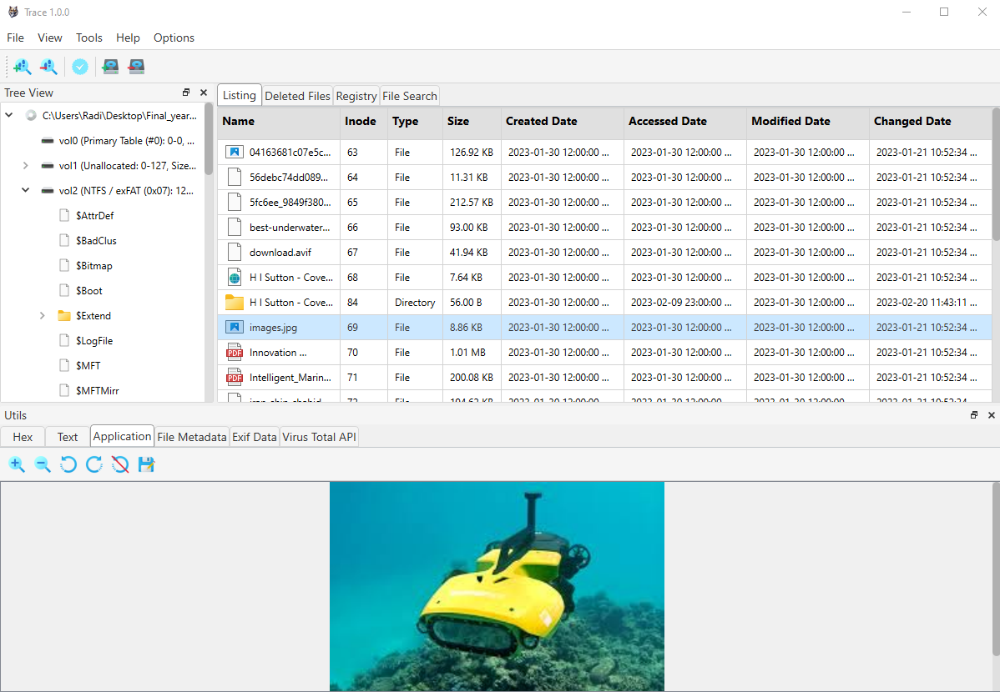
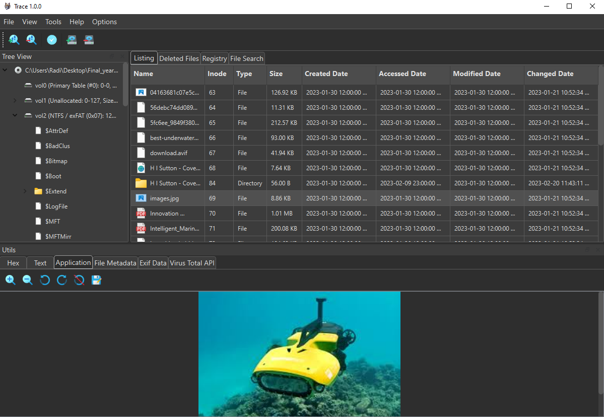

<h1 align="center">ForensAI</h1>
<h1 align="center">Version-1.1.0</h1>
<p align="center">
  <strong>ForensAI</strong> is an AI-powered digital forensics platform for analyzing disk images. It provides risk scoring, file carving, artifact analysis, and court-admissible evidence handling with Groq cloud AI integration.
</p>

<p align="center">
  
</p>

## Navigation 🧭

- [Preview 👀](#preview-)
- [Features 🌟](#features-)
- [Screenshots 📸](#screenshots-)
- [Supported Image Formats 💾](#supported-image-formats-)
- [Tested File Systems 🗂️](#tested-file-systems-%EF%B8%8F)
- [Cross-Platform Compatibility 🖥️💻](#cross-platform-compatibility-%EF%B8%8F)
- [Getting Started 🚀](#getting-started-)
  - [Prerequisites 🛠️](#prerequisites-)
  - [Configuration ⚙️](#configuration-%EF%B8%8F)
  - [Running the Tool ▶️](#running-the-tool-%EF%B8%8F)
- [Built With 🧱](#built-with-)
- [Work in Progress 🛠️](#work-in-progress-)
- [Testing & Feedback 🧪](#testing--feedback-)
- [Contributing 🤝](#contributing-)


## Preview 👀 &nbsp;&nbsp;&nbsp;&nbsp; [⬆️](#forensai)

<p>
  <br/>
  
  <br/>
  
  <br/>
</p>

<br>

## Features 🌟 &nbsp;&nbsp;&nbsp;&nbsp; [⬆️](#forensai)

### Acquisition & Image Handling
✅ **Physical Disk Acquisition**: Acquire physical disks and logical partitions to raw .dd format with on-the-fly hash computation (MD5, SHA1, SHA256) \
✅ **Image Mounting**: Mount forensic disk images (Windows via Arsenal Image Mounter, macOS via hdiutil, Linux via ewfmount) \
✅ **E01 Image Verification**: Verify the integrity of E01 disk images \
✅ **Convert E01 to Raw**: Convert E01 disk images to raw .dd format

### Analysis & Viewers
✅ **Tree Viewer**: Navigate through disk image structure including partitions, directories, and files \
✅ **Hex Viewer**: View file content in hexadecimal format \
✅ **Text Viewer**: View file content as text with string extraction and pagination \
✅ **Application Viewer**: View images (JPG, PNG, GIF, BMP, TIFF, WEBP, AVIF), PDFs, audio/video, and Office documents \
✅ **File Metadata**: View detailed file metadata including timestamps (created, accessed, modified, changed) \
✅ **EXIF Data Extraction**: Extract and display EXIF metadata from photos \
✅ **Registry Viewer**: View and examine Windows registry hive files \
✅ **Message Decoding**: Decode messages from Base64, Hex, URL, HTML, Octal, and Binary encodings (Text tab right-click menu)

### AI & Risk Analysis
✅ **Groq AI Integration**: Cloud AI-powered forensic analysis using Llama 3.3 70B model \
✅ **Risk Scoring**: 28 forensic rules producing 0-100 risk scores with severity tiers (Critical, High, Medium, Low, Info) \
✅ **Priority View**: Risk-scored artifact browser with AI-powered risk explanations \
✅ **Confidence Tracking**: Certainty metrics for AI-derived facts (Complete, Good, Partial, Damaged, Fragment)

### File Recovery & Search
✅ **File Carving**: Recover deleted files from disk images with confidence scoring (PDF, JPG, PNG, GIF, WAV, MOV, MP4, WMV, ZIP, BMP, DOCX, XLSX, PPTX) \
✅ **File Search**: Search files across the disk image by name or extension type \
✅ **Deleted Files View**: Browse and recover carved files with thumbnails

### Forensic Accountability
✅ **Case Audit Dashboard**: Case statistics, media analysis, and audit trail browser \
✅ **Audit Logging**: Immutable JSONL audit trail with SHA-256 hash chain for court defensibility \
✅ **Chain-of-Custody**: All risk assessments and AI interactions logged for forensic integrity

### Visualization & Reporting
✅ **Mind Map**: Interactive filesystem visualization with filter by file type, tree/radial layouts, and statistics \
✅ **Forensic Report Generator**: Generate forensic reports from analysis results \
✅ **VirusTotal API Integration**: Check files for malware using the VirusTotal API \
✅ **Veriphone API Integration**: Verify phone numbers found during analysis \
✅ **Dark Mode & Light Mode**: Full theme support

<br>

## Demo of Application Working process 📸 &nbsp;&nbsp;&nbsp;&nbsp; [⬆️](#forensai)

<a href="Screencasts/Screencast From 2026-02-11 15-34-41.webm">

## Supported Image Formats 💾 &nbsp;&nbsp;&nbsp;&nbsp; [⬆️](#forensai)

| Image Format                                   | Extensions             | Split   |  Unsplit |
|------------------------------------------------|------------------------|---------|----------|
| EnCase® Image File (EVF / Expert Witness Format)| `*.E01` `*.Ex01`       | ✔️      | ✔️       |
| SMART/Expert Witness Image File                | `*.s01`                | ✔️      | ✔️       |
| Single Image Unix / Linux DD / Raw             | `*.dd`, `*.img`, `*.raw` | ✔️    | ✔️       |
| AccessData Image File                          | `*.ad1`                | ✔️      | ✔️       |
| ISO Image                                      | `*.iso`                |         | ✔️       |
| macOS Disk Image                               | `*.dmg`                |         | ✔️       |

<br>

## Tested File Systems 🗂️ &nbsp;&nbsp;&nbsp;&nbsp; [⬆️](#forensai)

| File System | Tested |
|-------------|--------|
| NTFS        | ✔️     |
| FAT32       | ✔️     |
| exFAT       | ✔️     |
| HFS+        |        |
| APFS        |        |
| EXT2,3,4    |        |

<br>

## Getting Started 🚀 &nbsp;&nbsp;&nbsp;&nbsp; [⬆️](#forensai)

### Prerequisites 🔧


#### For Windows:
*There's a compatibility issue with Python 3.12. Please install Python 3.11 from the official Python website: https://www.python.org/downloads/release/python-3110/
<br>

If you don't already have Microsoft C++ Build Tools installed, you'll need to install them to compile required packages like libewf-python and pytsk3.

```
If you encounter this error while installing dependencies:

"Microsoft Visual C++ 14.0 or greater is required"
It means your C++ Build Tools are missing or outdated.
Please follow the steps below to install the latest version of "C++ Build Tools".
```

Step 1: Download and Install Microsoft C++ Build Tools - https://visualstudio.microsoft.com/visual-cpp-build-tools/
During the installation, make sure to select the following workloads:
  - Desktop development with C++
  - C++ build tools

Step 2: Install the Dependencies
```bash
pip install -r requirements.txt
```


#### For macOS - Apple Silicon:

Create a virtual environment with python 3.11

```bash
python3.11 -m venv venv
source venv/bin/activate
```

```bash
chmod +x install_macos_silicon.sh
```

```bash
./install_macos_silicon.sh
```
**This script will:**
- Check if Homebrew is installed and offer to install it if it's not.
- Install necessary system dependencies (ffmpeg and poppler) using Homebrew.
- Install all Python dependencies specified in requirements_macos_silicon.txt using pip.


#### For Ubuntu on WSL:
```bash
chmod +x WSL_Ubuntu_install.sh
```

```bash
./WSL_Ubuntu_install.sh
```

**This script will:**

- Update package lists and install necessary system packages including graphics libraries and sound management tools.
- Install necessary Python dependencies from requirements_macos_silicon.txt (same requirements for Ubuntu).


### Configuration ⚙️

**API Keys Configuration**: The tool integrates with several APIs. To configure API keys, go to **Options > API Keys** in the menu:

| API | Purpose | Where to get a key |
|-----|---------|-------------------|
| **Groq** | AI-powered forensic analysis | [console.groq.com](https://console.groq.com) (free) |
| **VirusTotal** | Malware scanning | [virustotal.com](https://www.virustotal.com) |
| **Veriphone** | Phone number verification | [veriphone.io](https://veriphone.io) |


### Running the Tool ▶️


```bash
python main.py
```

### Using Physical Disk Acquisition 💾

ForensAI includes physical disk acquisition that allows you to create forensic images of physical disks.

**Requirements:**
- Administrator/root privileges
- Sufficient storage space for the disk image

**Using the GUI:**

1. Launch ForensAI as Administrator
2. Go to **Tools > Acquire Physical Disk**
3. Select the physical drive from the dropdown
4. Choose output directory and format (Raw .dd or E01)
5. Select hash algorithms (MD5, SHA1, SHA256)
6. Enter operator name and optional notes
7. Type the exact confirmation string (e.g., `CONFIRM PHYSICALDRIVE0`)
8. Click **Start Acquisition**

**Using the CLI:**

List available disks:
```bash
python tools/acquire_cli.py list
```

Acquire a disk:
```bash
# Windows
python tools/acquire_cli.py acquire --drive 0 --output C:\Evidence\disk0.dd --md5 --sha1 --operator "John Doe"

# Linux
sudo python tools/acquire_cli.py acquire --device /dev/sdb --output /evidence/disk.dd --md5 --sha1 --operator "John Doe"
```

Dry-run simulation (for testing):
```bash
python tools/acquire_cli.py simulate --output C:\Evidence\sample --size 100 --operator "Test User"
```

**Output Files:**

The acquisition process creates:
- `image_YYYYMMDDTHHMMSS.dd` - The raw disk image
- `image_YYYYMMDDTHHMMSS.dd.metadata.json` - Acquisition metadata with hashes, device info, and timestamps
- Database record in `tools/new_database_mappings.db`

**Safety Features:**
- Requires explicit confirmation string before imaging
- Administrator privilege checks
- Read-only access to physical disks
- On-the-fly hash computation for integrity verification
- Comprehensive logging and metadata generation
- Abort capability during acquisition

<br>

## Built With 🧱  &nbsp;&nbsp;&nbsp;&nbsp; [⬆️](#forensai)

- [pytsk3](https://pypi.org/project/pytsk3/) - Python bindings for The Sleuth Kit
- [libewf-python](https://github.com/libyal/libewf) - Library to access the Expert Witness Compression Format (EWF)
- [PySide6](https://pypi.org/project/PySide6/) - Qt-based GUI framework
- [Groq API](https://console.groq.com) - Cloud AI for forensic analysis (Llama 3.3 70B)
- [Arsenal Image Mounter](https://arsenalrecon.com/products/image-mounter/) - For mounting forensic disk images (Windows)
- [PyMuPDF](https://pymupdf.readthedocs.io/) - PDF rendering
- [Pillow](https://pillow.readthedocs.io/) - Image processing with forensic-grade truncated image support


## Work in Progress 🧑‍🔧  &nbsp;&nbsp;&nbsp;&nbsp; [⬆️](#forensai)

- **Direct Video/Audio Playback**: Currently, the video and audio player saves files temporarily before playing them. The goal is to enable direct playback from disk image streams for faster performance.
- **Integrated File Search and Viewer**: The file search results are not yet connected to the Viewer tabs (Hex, Text, Application, Metadata). Clicking a search result should navigate to and display that file.
- **Color Issues in Dark Mode**: The software currently has some colour display issues on Linux and macOS systems when using dark mode. Certain UI elements may not be clearly visible or may appear incorrectly.

## Testing & Feedback 🧪  &nbsp;&nbsp;&nbsp;&nbsp; [⬆️](#forensai)

- **Tested Formats**: The tool has primarily been tested with `dd` and `E01` files. While these formats are well-supported, additional testing with other formats, such as `Ex01`, `Lx01`, `s01`, and others, is needed.
- **Tested File Systems**: The tool has been tested on NTFS and FAT32 file systems. Testing on additional file systems like exFAT, HFS+, APFS, EXT4, and others is needed to ensure broader compatibility.
- **Call for Samples**: If you have disk images in formats that are less tested (`Ex01`, `Lx01`, `s01`, etc.), your contributions would be greatly appreciated to help improve the tool's compatibility and robustness.
- **Feedback Welcome**: Please report any issues or unexpected behaviour to help improve the tool. Contributions and testing feedback are encouraged and welcomed.

## Contributing 🤝 &nbsp;&nbsp;&nbsp;&nbsp; [⬆️](#forensai)

I welcome contributions from the community to help improve **ForensAI**! If you're interested in contributing, here's how you can get involved:

### How to Contribute

1. **Report Issues**: If you find any bugs or have suggestions for improvements, please document them clearly with as much detail as possible to help address the issue effectively.
2. **Submit Changes**: If you have a fix or feature you'd like to contribute, ensure your code adheres to the coding standards and includes tests where applicable.
3. **Provide Testing Samples**: If you have disk images in formats that are less tested (`Ex01`, `Lx01`, `s01`, etc.), your contributions would be greatly appreciated to help improve the tool's compatibility and robustness.
4. **Review and Feedback**: Review changes and provide feedback to help refine and enhance the tool.


